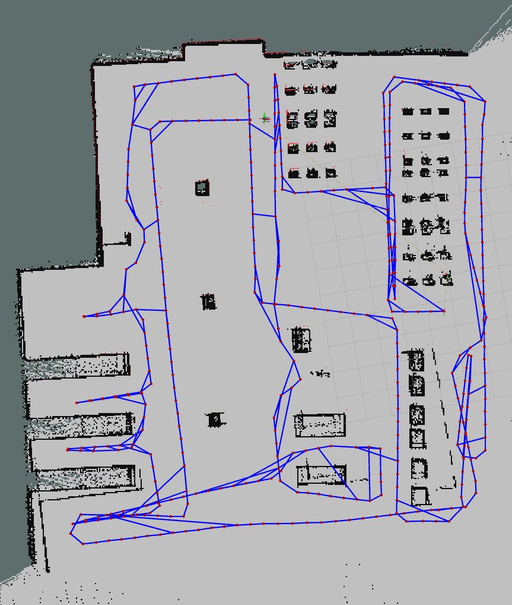

# Warehouse Robot Project in ROS2 Jazzy
This is a ROS project where a robot navigates in a warehouse and avoids collisions with obstacles and workers. The software was developed on an Ubuntu **24.04.2 LTS (noble)** system in **Visual Studio Code** and programmed in **Python**. 

## Installation
In order to run the application you have to install **ROS2 Jazzy** and some requiered packages for ROS2. To install ROS2 you can follow these [installation instructions](https://docs.ros.org/en/jazzy/Installation.html). I also, recommend to install the [Terminator](https://innovativeinnovation.github.io/ubuntu-setup/terminals/terminator.html).

### Required packages for ROS, Rviz and Gazebo
```
$ sudo apt-get update && sudo apt-get upgrade
$ sudo apt-get install python3-pip
$ sudo install rosdep
$ rosdep update
$ rosdep install —from-paths src –y —ignore-src

$ sudo apt-get install transforms3d
$ sudo apt install ros-jazzy-gz-*

$ sudo apt install ros-jazzy-rqt-controller-manager 
$ sudo apt install ros-jazzy-image-transport ros-jazzy-rviz-image-tools
```

### ROS2 Control and additional packages
```
$ sudo apt-get update && sudo apt-get upgrade && sudo apt-get install ros-jazzy-*ros2-control*
$ rosdep install -i --from-path src --rosdistro $ROS_DISTRO -y

$ sudo apt-get install ros-jazzy-diff-drive-controller
$ sudo apt-get install ros-jazzy-hardware-interface
$ sudo apt install ros-jazzy-joint-state-publisher
$ sudo apt-get install ros-jazzy-tf-transformations
$ sudo apt-get install ros-jazzy-key-teleop
```

### Nav2 
```
$ sudo apt install ros-jazzy-navigation2
$ sudo apt-get install ros-jazzy-nav2*

$ sudo apt install ros-jazzy-slam-toolbox
```

### Clone the repository and build
Create a directory with a name of your choice and clone the repository.
```
$ git clone https://github.com/michailtam/warehouse_robot.git
$ colcon build
$ . install/setup.bash
```

## Running the simulation:
To run the simulation follow the bellow steps. **Note:** All steps, should be executed in order, 
otherwise the simulation could not work properly.

### Terminal 1: Start the simulation process
To execute SLAM issue
```
$ ros2 launch warehouse_bot_bringup simulated_robot.launch.py use_slam:=true
```
To execute the Localization process issue
```
$ ros2 launch warehouse_bot_bringup simulated_robot.launch.py
```

### Terminal 2: Moving the robot
```
$ ros2 run teleop_twist_keyboard teleop_twist_keyboard
```

### Terminal 3: Start navigation
```
$ ros2 launch warehouse_bot_navigation navigation.launch.py
```

### Rviz configuration
To visualize everything properly in rviz you need to make some settings.
- Set Durability Policy for the `Map` to **Transiant Local**
- Open Config -> /opt/ros/jazzy/share/nav2_bringup/rviz/nav2_default_view.rviz

|  |

## Screenshots of the simulation
| **Warehouse** | **Warehouse** |
|-----------------|-----------------|
|      |      |

| **Static obstacle avoidance** | **Dynamic obstacle avoidance** |
|-----------------|-----------------|
|      |      |

| **Map creation** | **Map cleared with Gimp** |
|-----------------|-----------------|
|      |      |

